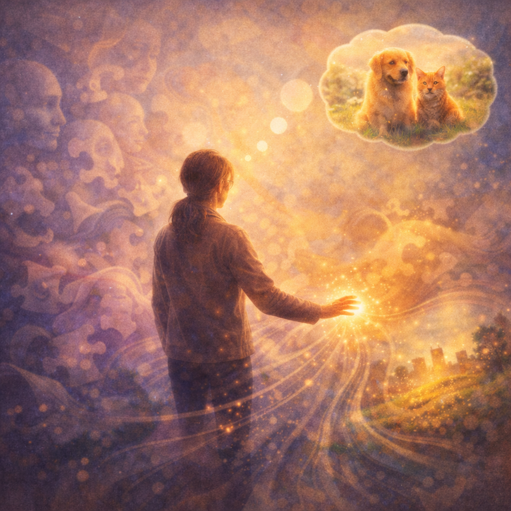

# Ordlös förståelse: Där mening finns före orden {.chapter}

Kapitel 13: Latent Space

*Latent space är känslan du har precis innan du hittar rätt ord -- det ögonblick då du vet exakt vad du menar, men ännu inte har formulerat det.*

Du vaknar mitt i natten. Någonting är fel.

Inte ett ljud som väckte dig. Inte hunger eller törst. Bara en känsla. En diffus oro som fyller rummet. Du ligger stilla och försöker greppa vad det är. Något med jobbet? Nej. Något med barnen? Kanske. Eller vänta -- var det något du glömde?

Känslan är verklig. Den är påtaglig. Du *vet* att den pekar på något. Men vad? Du famlar efter ord, efter konkreta tankar, men de glider undan. Det är som att försöka gripa dimma.

Välkommen till latent space.

## Bryggan till AI

Det engelska ordet "latent" betyder *dold*, *vilande*, *ännu inte manifesterad*. Det beskriver precis det tillstånd du upplevde i sängen: något som existerar, men som ännu inte tagit synlig form.

I AI-världen är latent space det inre rum där mening existerar innan den blir till pixlar, ord eller ljud. Det är modellens version av känslan-innan-tanken.

När en bildgenererande AI skapar ett porträtt arbetar den inte direkt med pixlar. Den börjar i ett abstrakt, komprimerat tillstånd -- en slags matematisk *essens* av vad bilden ska vara. Först därefter översätts denna essens till de miljontals färgpunkter som vi ser.

Det är skillnaden mellan att *förstå* vad du vill säga och att *formulera* det.

## Känslan som kommer före

Tänk på senaste gången du försökte beskriva något komplext.

Kanske var det en dröm du hade. Du vaknade med en tydlig känsla av vad drömmen handlade om -- stämningen, betydelsen, kärnan. Men när du försökte berätta för din partner gled orden fel. "Det var som... nej, mer att... hmm, du vet när man..."

Eller tänk på hur det är att minnas någon man älskar. Inte genom att lista egenskaper -- "brun hår, vänlig, gillar att laga mat" -- utan genom den omedelbara, ordlösa *känslan* av vem personen är. Den förståelsen är rikare än någon beskrivning skulle kunna vara.

I det ögonblicket befinner du dig i ditt eget latent space.

Du har en komprimerad representation av något komplext. Inte varje detalj, men essensen. Inte varje ord, men meningen. Och från den komprimerade förståelsen kan du sedan *generera* en beskrivning -- olika varje gång, anpassad till lyssnaren, men alltid från samma inre källa.

## Hur AI:ns latent space fungerar

Hur fungerar detta i praktiken?

En bildgenererande AI som Stable Diffusion arbetar med två världar: den yttre världen av pixlar och den inre världen av latenta representationer.

**Komprimering (encoding)**: Ta en bild på 512 x 512 pixlar. Det är nästan 800 000 färgvärden att hålla reda på. AI:n komprimerar detta till en *latent representation* -- kanske bara 16 000 tal. Det är 98% mindre, men essensen bevaras.

**Det latenta rummet**: I detta komprimerade tillstånd finns bildens *mening* -- inte varje pixel, men det som gör bilden till vad den är. Här kan modellen "tänka" effektivt, manipulera, förändra.

**Återskapande (decoding)**: Från den latenta representationen kan modellen sedan generera tillbaka en bild. Inte nödvändigtvis identisk med originalet, men med samma essens, samma känsla, samma innehåll.

Det är som skillnaden mellan att ha en minnesbild av din barndoms sovrum och att beskriva varje möbel i detalj. Minnesbilden är komprimerad men meningsfull. Beskrivningen är fullständig men tar längre tid.

## Vad gör latent space speciellt?

Det anmärkningsvärda med latent space är inte bara komprimeringen -- det är vad som blir möjligt i det komprimerade tillståndet.

**Smidiga övergångar**: I latent space kan du röra dig gradvis mellan två koncept. Ta en latent representation av ett vinterlandskap och en av en sommaräng. Rör dig långsamt mellan dem, och du får alla årstider däremellan -- naturligt, smidigt, utan hack.

**Kreativ utforskning**: Du kan vandra runt i latent space och upptäcka nya kombinationer. "Vad finns mellan en björn och en stol?" I pixelvärlden är frågan meningslös. I latent space kan du faktiskt gå dit och se.

**Meningsfull aritmetik**: Precis som med embeddings kan du göra beräkningar. Men medan embeddings-kapitlet handlade om *ord* handlar latent space om *hela representationer* -- bilder, ljud, komplexa strukturer.

Tänk på det som skillnaden mellan en ordbok och ett recept. Embeddings visar var ord ligger i förhållande till varandra. Latent space är där hela rätter -- med alla sina ingredienser, texturer och smaker -- kan blandas, modifieras och skapas.

## Den kreativa drömfabriken

Moderna bildgeneratorer som Stable Diffusion arbetar helt i latent space. Processen ser ut så här:

1. **Börja med brus**: Matematiskt kaos -- slumpmässiga tal utan mening
2. **Låt texten guida**: Din prompt ("en rödhårig kvinna i solnedgång") översätts till en riktning i latent space
3. **Gradvis förfining**: Steg för steg rensas bruset bort, styrt av promptens riktning
4. **Dekoda till bild**: I sista steget översätts resultatet till pixlar

Det är som att skulptera i dimma. Du börjar med ingenting, låter din intention forma molnet, och till slut framträder formen -- allt i det dolda rummet där bilder existerar som möjligheter snarare än som pixlar.

## Skillnaden mot embeddings

I kapitel 6 beskrev vi embeddings som ett "tankens landskap" -- ett rum där ord placeras efter betydelse, där liknande begrepp ligger nära varandra.

Latent space är besläktat men annorlunda.

**Embeddings** är som en karta över enskilda platser. Varje ord får en koordinat. "Stockholm" ligger nära "Uppsala", "huvudstad" ligger nära "metropol".

**Latent space** är som en karta över hela resor. Inte enskilda orter, utan hela färder med allt vad de innehåller -- landskapen mellan städerna, vädret längs vägen, stämningen i varje ögonblick.

Embeddings handlar om att *representera* begrepp. Latent space handlar om att *komprimera* och *generera* komplexa helheter.

Eller uttryckt genom vår analogi: Embeddings är som ditt mentala ordförråd -- varje begrepp på sin plats. Latent space är känslan du har innan du väljer vilket ord du ska använda.

## Drömmarnas logik

Det finns en parallell till drömmar.

I drömmen komprimeras upplevelser på märkliga sätt. Din gamla skola smälter samman med nuvarande arbetsplats. En person är samtidigt din mormor och din chef. Tidslinjer kollapsar.

Latent space har liknande egenskaper. I det komprimerade rummet kan koncept flyta in i varandra. Gränser som är skarpa i verkligheten -- mellan ansikte A och ansikte B, mellan stil X och stil Y -- blir mjuka och överskridliga.

Men analogin har sina gränser. Drömmar har psykologisk betydelse, emotionell laddning, funktion för minneskonsolidering. AI:ns latent space är matematiskt. Det finns ingen drömmande, inget undermedvetet, ingen mening bortom statistiken.

## Begränsningar och ärlighet

Var brister analogin?

**Ingen upplevare**: Din ordlösa förståelse upplevs av dig -- det finns ett subjekt som vet. Latent space är siffror. Ingen "känner" de latenta representationerna.

**Ingen tid**: Din känsla-innan-orden utvecklas. Du tänker vidare, fördjupar, omvärderar. En latent representation är en statisk ögonblicksbild -- frusen i ett matematiskt nu.

**Perfekt rekonstruktion**: Från din diffusa känsla kan du aldrig perfekt återskapa originalet. Du minns inte varje detalj av drömmen, varje ord i samtalet. AI:ns decoder kan återskapa bilder med häpnadsväckande precision från sina latenta representationer.

**Inget urval efter mening**: Din hjärna komprimerar selektivt. Emotionellt viktiga saker bevaras, triviala detaljer försvinner. AI:ns latent space komprimerar enligt matematiska principer -- utan känsla för vad som är "viktigt".

Det är skillnaden mellan minne och arkiv.

## Varför det spelar roll

Latent space förklarar hur moderna AI-system kan vara så kreativa.

De arbetar inte direkt med pixlar eller bokstäver -- de arbetar med komprimerad mening. I det rummet kan de utforska, kombinera, interpolera på sätt som vore omöjliga i den "råa" datan.

När du ber en bildgenerator om "en katt i Van Goghs stil" hittar den inte en sådan bild i sin träningsdata. Den navigerar till rätt plats i latent space -- där "katt" och "Van Gogh-stil" möts -- och genererar något som aldrig existerat förut.

Det är som om du hade en ordlös förståelse av både katter och Van Gogh, och kunde låta dem smälta samman i ditt sinne innan du försökte beskriva resultatet.

## Slutord

Nästa gång du vaknar med en känsla du inte kan sätta ord på -- den där diffusa förnimmelsen av något viktigt, något meningsfullt, något som finns innan språket -- tänk på att du upplever din egen version av latent space.

Det är där mening bor innan den tar form.

AI:n har byggt matematiska versioner av samma tillstånd. Komprimerade rum där essenser existerar utan detaljer, där bilder finns som möjligheter, där gränser mellan koncept är mjuka och överskridliga.

Skillnaden är att för dig är känslan-innan-orden en upplevelse.

För AI:n är det bara mycket effektiv matematik.

Men strukturen -- det dolda rummet där mening existerar före manifestation -- den är häpnadsväckande lik.

## Sammanfattning

**AI-koncept**: Latent space 
**Mänsklig motsvarighet**: Ordlös förståelse / känslan innan orden 
**Kom ihåg**: Latent space är AI:ns inre rum för komprimerad mening -- där bilder existerar innan de har pixlar, precis som din förståelse finns innan du hittar rätt ord.

